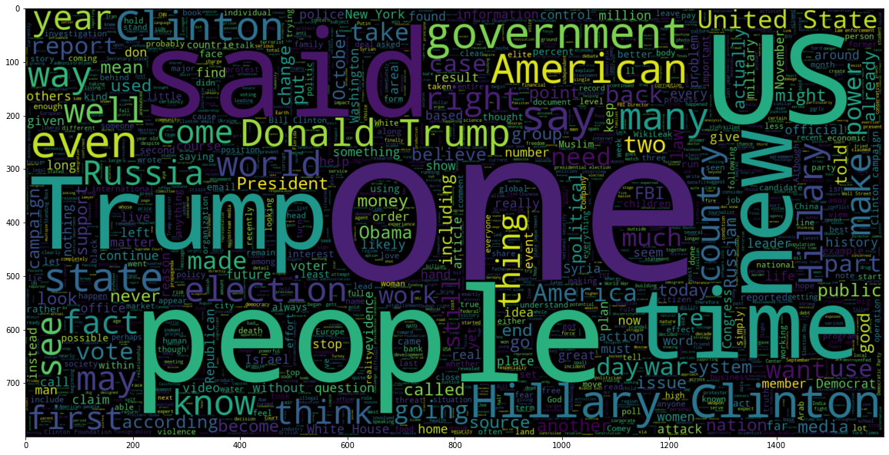

# 2022-BerConvoNet
BerConvoNet: A deep learning framework for fake news classification - Monika Choudhary, Satyendra Singh Chouhan ∗ , Emmanuel S. Pilli, Santosh Kumar Vipparthi
published on 2021.

# Introduction
This paper presents a deep learning framework, BerConvoNet, to classify the given news text into fake or real with minimal error.
The presented framework has two main building blocks: a news embedding block (NEB) and a multi-scale feature block (MSFB). NEB uses Bidirectional Encoder Representations from Transformers (BERT) for extracting word embeddings from a news article. Next, these embeddings are fed as an input to MSFB. The MSFB consists of multiple kernels (filters) of varying sizes. It extracts various features from news word embedding. The output of MSFB is fed as an input to a fully connected layer for classification. 

# Current Work
Reproduce the whole framework using BERT to obtain word embeddings to fed as input to train bert_cnn_model.

# Install

1. Create a conda environment with python version no more than 3.6

``` shell
conda create -n BerCovNet python=3.6

conda activate BerCovNet
```

2. Install requirements

```shell
pip install requirements.txt
```


# Results

